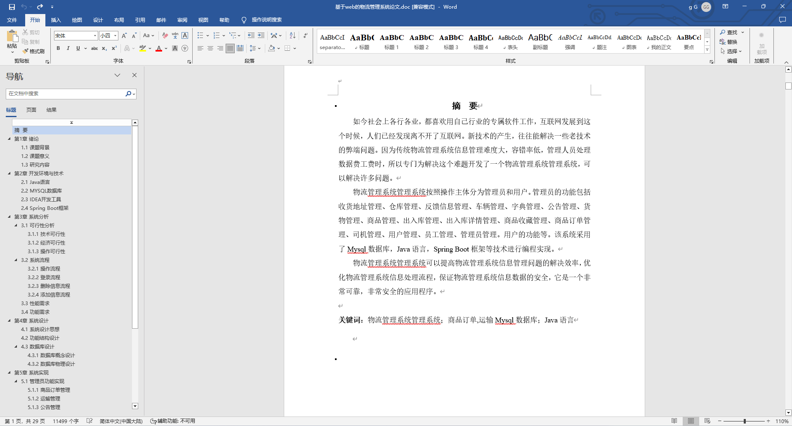
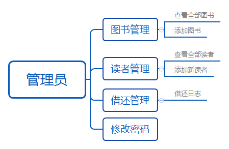
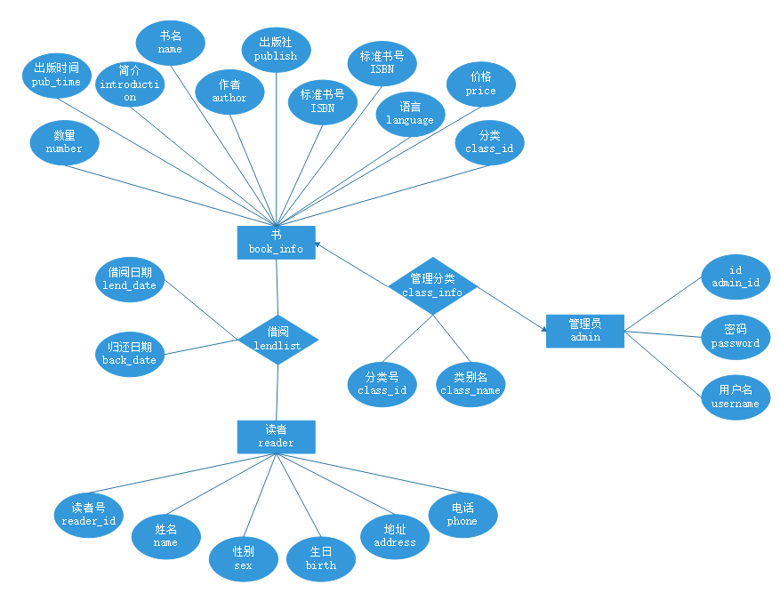
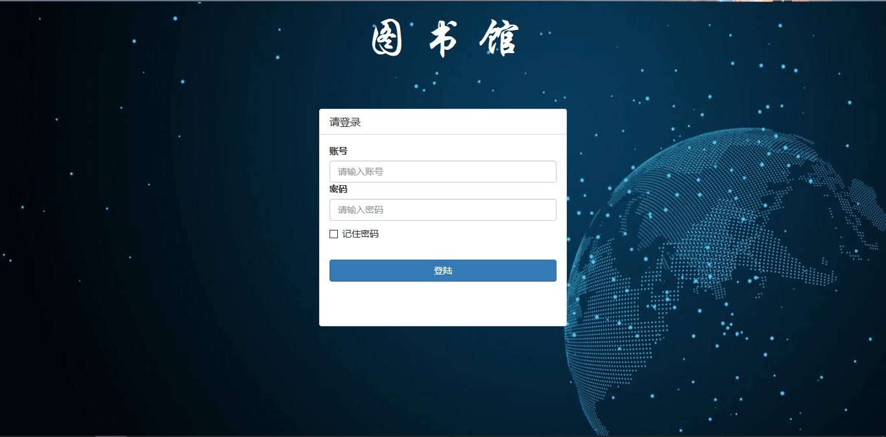
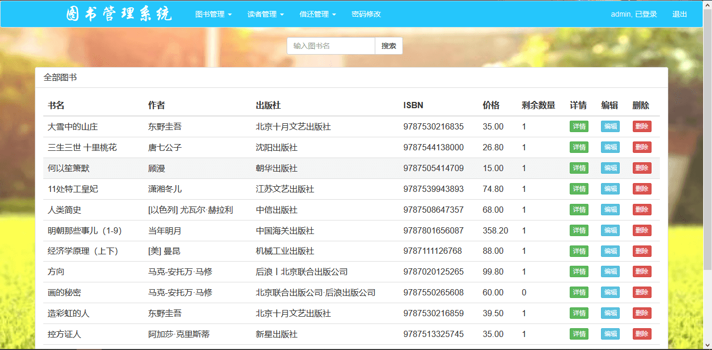
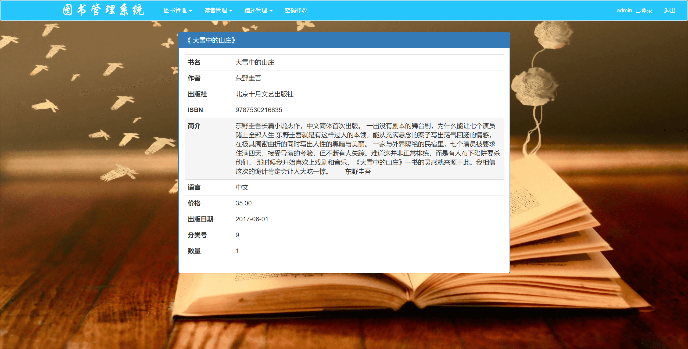
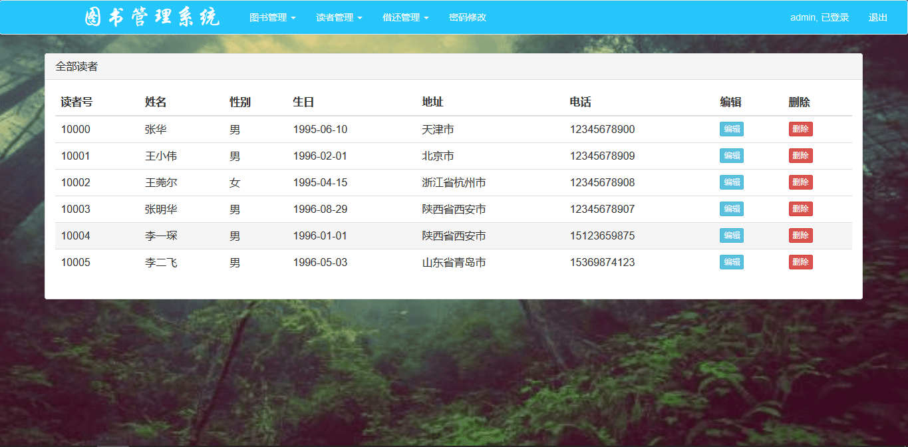
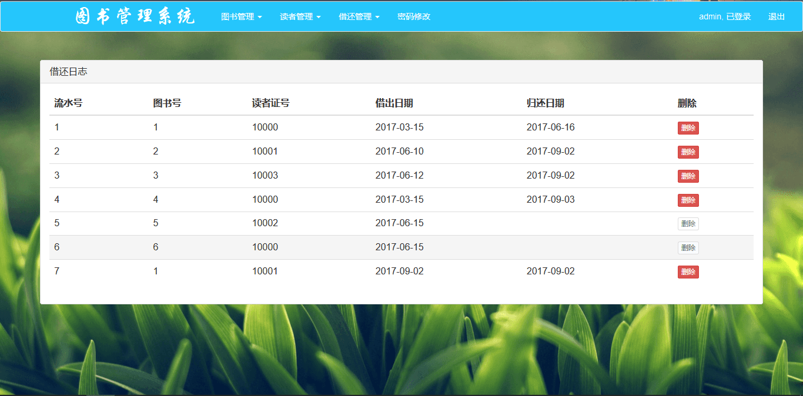
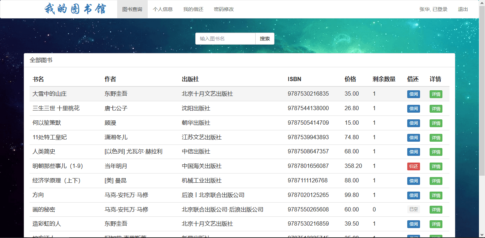

## 基于SSM框架的图书馆管理系统系统(程序+报告)

###  获取sql数据库文件: 从戎源码网 (https://armycodes.com/) QQ: 386869957 QQ群: 377586148
###  所有系统地址: (https://github.com/YuLin-Coder/AllProjectCatalog) 
###  所有项目以及源代码本人均调试运行无问题 可支持远程安装部署调试、定制修改、代码讲解

## 项目介绍
基于SSM框架的图书馆管理系统系统，该项目分为个角色。主要功能如下
基于Spring + Spring MVC + MyBatis的图书馆管理系统，使用Maven进行包管理。主要功能包括：图书查询、图书管理、图书编辑、读者管理、图书的借阅与归还以及借还日志记录等。

系统账号信息
管理者账号：123456/123456
读者账号：10000/123456

## 项目技术
- 编程语言：Java
- 数据库：MySQL
- 前端技术：JSP、JavaScript、bootstrap、JQuery
- 后端技术：Spring、SpringMVC、MyBatis

## 运行环境
- JDK版本：JDK1.8及以上
- 开发工具：IDEA、Ecplise、Myecplise都可以
- 数据库: MySQL5.7及以上
- Maven：maven3.0及以上

## 运行截图

